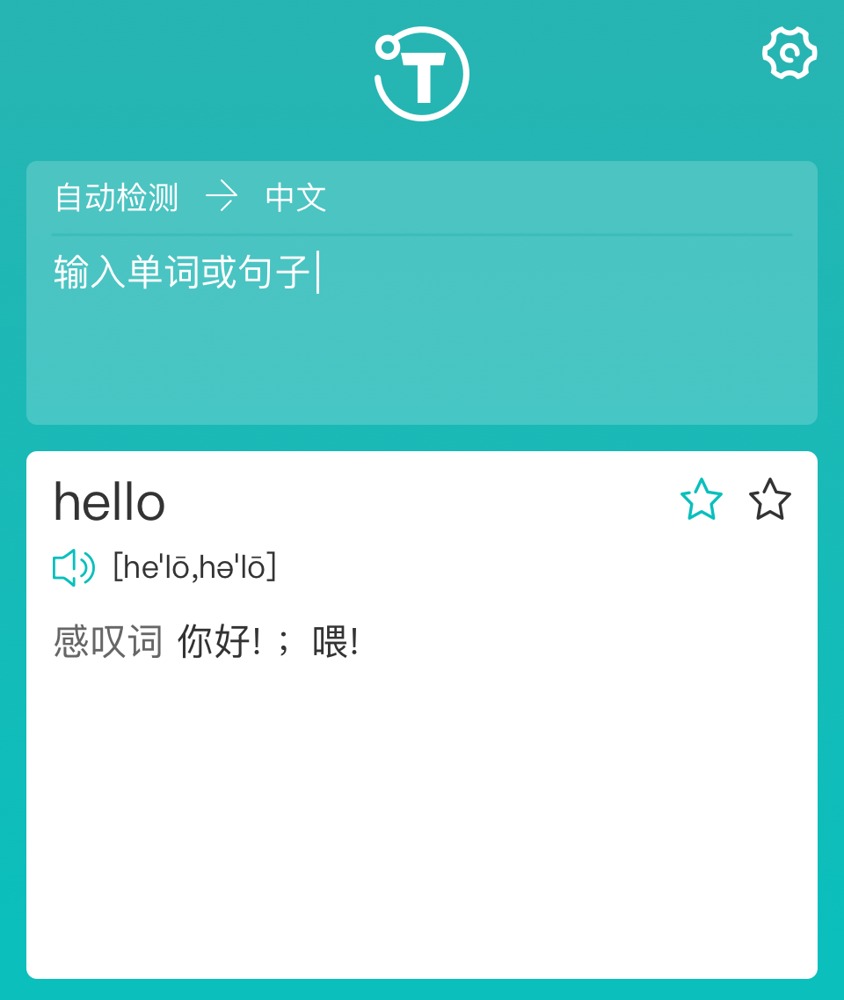
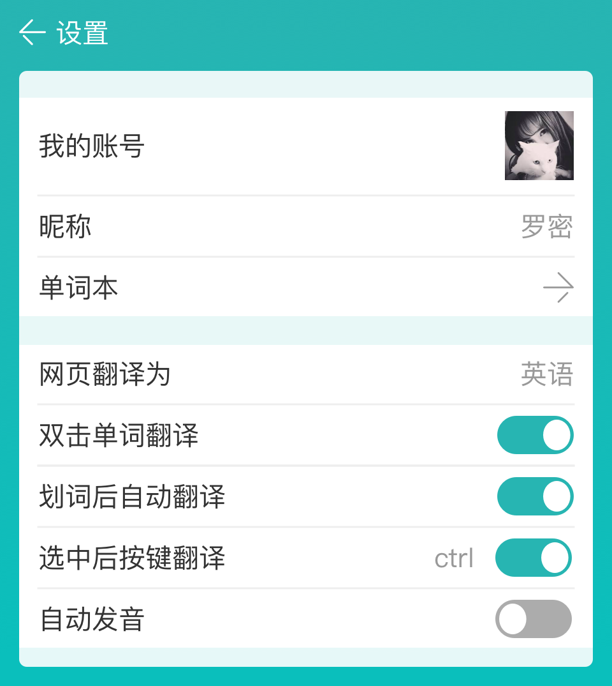
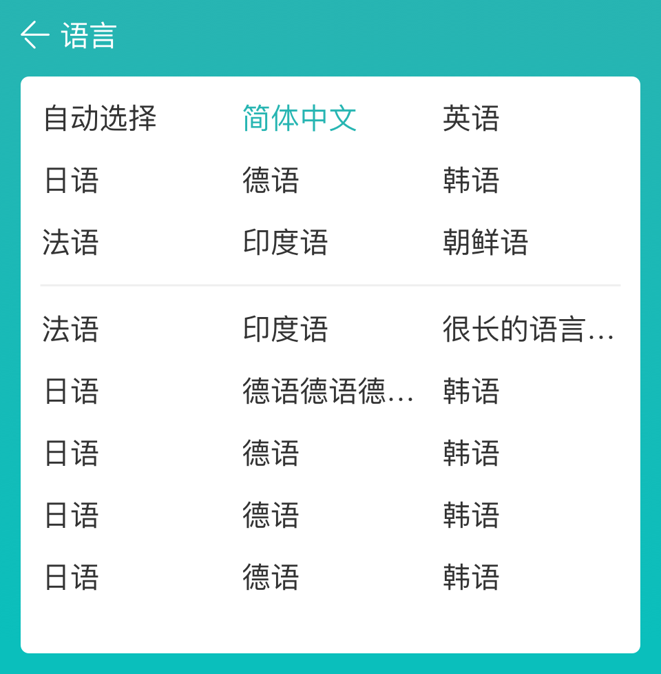

# translate man

[中文](./README-CH.md)

chrome store: [https://chrome.google.com/webstore/detail/translate-man/fapgabkkfcaejckbfmfcdgnfefbmlion](https://chrome.google.com/webstore/detail/translate-man/fapgabkkfcaejckbfmfcdgnfefbmlion)

firefox store: [https://addons.mozilla.org/zh-CN/firefox/addon/%E7%BF%BB%E8%AF%91%E4%BE%A0-translate-man/](https://addons.mozilla.org/zh-CN/firefox/addon/%E7%BF%BB%E8%AF%91%E4%BE%A0-translate-man/)

This is a browser plug-in (webExtension development), compatible with chrome and firefox, hundreds of languages ​​to achieve translation, call Google translation interface, focusing on user experience and speed.

Support the mouse to take words, zoned word translation, multi-lingual, user-friendly interface.

1. New UI, so that the interface a new look
2. Using Google translation interface, translation accuracy
3. Support up to 100 languages, automatically identify the language
4. User-friendly mode of operation, double-click translation, page word, all support
5. Completely free, support Google voice
6. Continuous development, if you feel good, remember a five-star rating

# design screenshot




## dev
```shell
$ npm install

$ npm run dev
```

## build
```shell
$ npm run build
```

## deploy
```shell
$ npm run deploy
```
